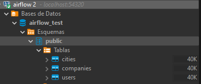
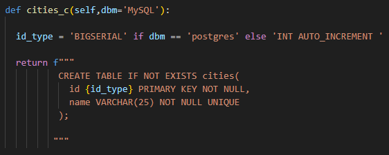
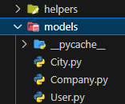
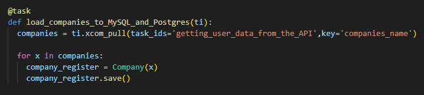

# Proceso de automatización de carga de datos hacia MySQL, PostgreSQL y Redis

El proceso de extracción, transformación y carga de datos constituye una parte bastante relevante en el flujo de vida de los datos y es una de las primeras cosas configurables después de obtener el input de cualquier lugar, el tema con todo esto es que mantener el proceso de una manera estática contribuye a la **reducción del rendimiento** empresarial y en general de los procesos internos; Problema que se resuelve con la automatización de este proceso, establecer **intervalos temporales de ejecución** en la extracción, transformación y carga de los datos a cualquier base de datos de la empresa elimina la preocupación en este tema y permite enfocarnos en cualquier otro procesos interno empresarial que necesite más cuidado o mano de obra.

Este proyecto desarrolla la temática de la **orquestación de datos** con herramientas como Airflow que permite la creación de flujos de trabajos mediante código Python, gestionando conexiones a bases de datos manejadas desde contenedores de Docker y utilidades que ofrece el mismo airflow como los hooks y decoradores. **Inclusive** se implementó una arquitectura modular con un buen manejo de archivos, un código legible y por supuesto programación orientada a objetos referenciada al famoso patrón de diseño MVC utilizado para el desarrollo back-end web.


## API Reference

Para la extracción de los datos utilicé una API pública llamada [JSONPlaceholder](https://jsonplaceholder.typicode.com/) que ofrece información variada, más específicamente para objetivos de desarrollo web por tener que ver con información de usuarios dentro de una plataforma, pero se puede usar tranquilamente para representar relaciones entre entidades y realizar prototipados.

Los endpoints usados fueron dos y se encuentran en funciones dentro del código como:

#### getting_user_data_from_the_API()

```http
  GET https://jsonplaceholder.typicode.com/users
```

| Keys | Type     | Example                |
| :-------- | :------- | :------------------------- |
| `id` | `Integer` | 1 |
| `name` | `String` | Leanne Graham |
| `username` | `String` | Bret |
| `email` | `String` | Sincere@april.biz |
| `address` | `JSON` | { "street": "Kulas Light", "suite": "Apt. 556","city":"Gwenborough", ... }|
| `phone` | `String` | 1-770-736-8031 x56442 |
| `website` | `String` | hildegard.org |
| `company` | `JSON` | { "name": "Romaguera-Crona", "catchPhrase": "Multi-layered ...", ... }|

> [!IMPORTANT]
> Estas columnas terminan siendo multivaluadas dentro de las dbs, por ende es necesario una normalizacion previa que por supuesto se explica posteriormente

#### load_user_posts_to_Redis()

```http
  GET https://jsonplaceholder.typicode.com/posts
```

| Keys | Type     | Example                       |
| :-------- | :------- | :-------------------------------- |
| `userId`      | `Integer` | 1 |
| `id`      | `Integer` | 2 |
| `title`      | `String` | qui est esse |
| `body`      | `String` | est rerum tempore vitae\nsequi sint nihil reprehenderit dolor beatae ...  |


## Normalizacion

Existe un comportamiento usual en la elaboración desinformada de entidades dentro de una base de datos relacional y es la redundancia. El nombre en sí mismo de los RDB comenta que la idea de usarlos es establecer relaciones y el hecho de que existan columnas con datos redundantes es una buena prueba del mal o inexistente uso de las llaves foráneas que colaboran al desarrollo escalable y mantenimiento de la base de datos.

En nuestro caso cualquier JSON existente dentro de alguna llave en nuestro JSON principal de respuesta es un claro caso de posible redundancia en los datos y por ende es importante dividir estos datos en tablas apartes para mantener el orden y desarrollar una db normalizada, estos datos serían los de `company` y `addres.city`.

 

Pero espera, `city` es solo una propiedad dentro del JSON completo de `address`, entonces  ¿Por qué no simplemente generamos otra tabla llamada `address` y guardamos todo inconscientemente? Bueno, eso implicaría primero que tuviésemos todas las direcciones de cada ciudad existente del país guardadas en nuestra base de datos suponiendo que tuviésemos a todo el país utilizando la aplicación, lo cual garantizaría un alto consumo innecesario, ya que realmente no necesitamos exactamente cada dirección de nuestros usuarios, sin embargo, para posibles análisis geográficos e inclusive desarrollo de modelos de IA, dividir la ciudad en una tabla aparte garantizaría primero, independencia por registro y segundo oportunidad de filtrado por ciudad bastante útil para consultas necesarias para la empresa. 

> [!TIP]
> Otro punto de vista de todo esto es que la cardinalidad de ciudad por usuario es de 1:M entonces se hace una tabla dimensional extra, de la misma manera en que puede suceder con la empresa, puede pasar que existan dos personas en una misma empresa.

## Arquitectura interna

Por default, el proyecto posee 4 carpetas de las cuales nos enfocaremos en donde sucede toda la magia, la carpeta `dags` donde se instancia el flujo de trabajo y se definen las tareas a realizar con cualquier otra configuración necesaria.

Como ya dijimos se desarrolló algo modular que permitiera ser escalable y abierto a extensiones, y siguiendo el flujo del código primero le prestaremos atención a la carpeta helpers que posee una clase *Airflow_PI* que representa la base de datos en general donde podemos encontrar dentro de métodos el retorno de los comandos SQL respectivos a la base de datos donde queramos guardar las tablas.



> [!NOTE]
> A class should be open to extensions, but closed for modifications.

Posteriormente por tabla existe una clase dentro de la carpeta `models` que tiene sus propias propiedades y por supuesto sus propios métodos independientes entre sí que se enfocan en una tarea en específico utilizando los hooks que ofrece airflow.

 

> [!NOTE]
> A class should have only single responsability and should have one and only one reason for change.

El desarrollo de las tareas, gracias a la arquitectura, se simplifica a llamar las funciones respectivas de los modelos por cada registro y/o JSON dentro de la lista que retorna la API principal; En caso tal de que exista algún error por inserción, creación y/o consulta de los datos de alguna tabla sabremos perfectamente a qué métodos de que archivo (modelo) dirigirnos para arreglarlo y optimizar el desarrollo de las actividades.

 

> [!IMPORTANT]
> Para Redis todo es bastante más sencillo, ya que simplemente se extraen los datos y así de desestructurados se envían a la base de datos con una llave preestablecida consultable.


## Activacion de contenedors

Si desea clonar el repo y usar airflow con la configuración preestablecida en el archivo `docker-compose.yaml`:

```bash
  docker-compose up airflow-init
  docker-compose up -d
```

Cualquier información sobre los usuarios se puede encontrar dentro del mismo archivo `.yaml`.


## Tech Stack

- Docker <image src="https://static-00.iconduck.com/assets.00/docker-icon-512x438-ga1hb37h.png" width=20 align="center" style="margin-left:10px" alt="Docker icon">
- Apache Airflow <image src="https://zimetrics.com/wp-content/uploads/2023/09/apache-airflow.png" width=40 align="center" style="margin-left:10px" alt="Airflow icon">
- Postgres <image src="https://cdn-icons-png.flaticon.com/512/5968/5968342.png" width=20 align="center" style="margin-left:10px" alt="Postgres icon">
- MySql <image src="https://cdn4.iconfinder.com/data/icons/logos-3/181/MySQL-512.png" width=40 align="center" style="margin-left:10px" alt="MySQL icon"> 
- Redis <image src="https://cdn4.iconfinder.com/data/icons/redis-2/1451/Untitled-2-512.png" width=20 align="center" style="margin-left:10px" alt="Redis icon">
- DBeaver <image src="https://static-00.iconduck.com/assets.00/dbeaver-icon-2048x2026-kcj6pqth.png" width=20 align="center" style="margin-left:10px" alt="DBeaver icon">
- Requests <image src="https://upload.wikimedia.org/wikipedia/commons/2/2c/Requests-logo.png" width=20 align="center" style="margin-left:10px" alt="Requests icon">

## Authors

- [@JoseOrejarena](https://www.linkedin.com/in/jose-orejarena/)

